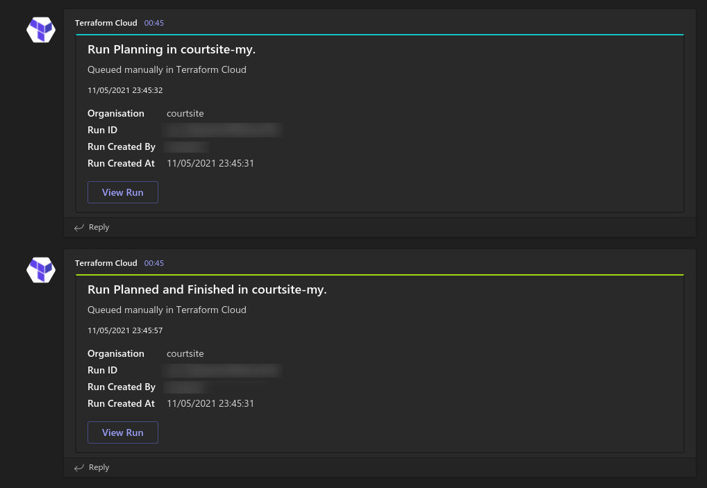
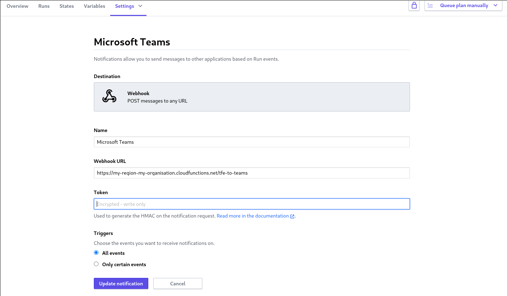

# clubhouse-to-teams

🏗️ A simple Google Cloud Function in Go to transform / proxy [Terraform Cloud / Enterprise (TFE)](https://www.terraform.io/cloud) webhook notifications to [Microsoft Teams](https://teams.microsoft.com/).

## Getting Started

### Prerequisites

- Ensure you have `gcloud` installed:
    - MacOS: `brew cask install google-cloud-sdk`
    - Others: https://cloud.google.com/sdk/gcloud
- Ensure you have authenticated with Google Cloud: `gcloud init`
- (Optional) Set your current working project: `gcloud config set project <project>`

### Deployment

1. Clone / download a copy of this repository
2. Copy `.env.sample.yaml` to `.env.yaml`, and modify the environment variables declared in the file
3. Run `./deploy.sh`
4. Configure TFE webhook notifications in `https://app.terraform.io/app/<organisation>/workspaces/<workspace>/settings/notifications`

